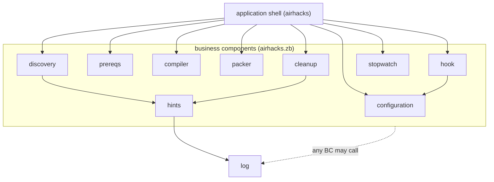

# zb (Zero Dependencies Builder)

**The entire build tool is a single ~30 KB `zb.jar`.** No install, no daemon, no plugin tree, no `~/.m2` — one tiny jar and a Java 25 runtime is the whole story.

Built with pure Java 25, zb compiles and packages your project with zero external dependencies — its own and, by default, yours. Projects that do need external JARs list them explicitly via the `classpath` property; zb never resolves or downloads anything.


## Why zb

- 🪶 **~30 KB, one jar** — the whole build tool fits in a single `zb.jar` you can read, commit, and copy anywhere
- 🚀 **Zero dependencies** — nothing to download but the jar itself; pure Java 25, no third-party libraries
- ⚡ **Instant builds** — no dependency resolution, no daemon warm-up; just `javac` and packaging
- 🔍 **Automatic main class detection** — no manifest boilerplate
- 📦 **Executable JAR generation** out of the box
- 🎯 **One command, zero config** — sensible defaults, optional `.zb` file when you want control

## Speed

No dependency resolution, no daemon, no warm-up — just `javac` and packaging. Cold-start, measured on LightMetal:

| Project | Build | Tests ([zunit](https://github.com/AdamBien/zunit)) |
|---------|-------|-------|
| [zb](https://github.com/AdamBien/zb) (builds itself) | **306 ms** | 6 unit tests in **547 ms** |
| [zsmith](https://github.com/AdamBien/zsmith) | **679 ms** | 18 unit tests in **1.3 s** |
| [lightmetal](https://github.com/AdamBien/lightmetal) | **662 ms** | 5 unit tests in **2.6 s** |

Build = compile + package the executable JAR.

Fast builds benefit AI coding agents as much as humans. A sub-second compile-package-test loop returns feedback almost instantly, so an agent can run more iterations with less waiting.

## Prerequisites

- Java 25 or later
- Git (for cloning the repository)

## Installation

### Quick Install (from latest release)

[`zbinstall`](zbinstall) is a single-file Java 25 script that fetches `zb.jar` and `zb.sh` from the latest GitHub release into the current directory:

```bash
# Fetch the installer and run it
curl -fsSLO https://raw.githubusercontent.com/AdamBien/zb/main/zbinstall
chmod +x zbinstall
./zbinstall

# Move both files onto your PATH
mv zb.jar zb.sh ~/bin/
```

The download is atomic — a partial download cannot replace an existing `zb.jar` or `zb.sh`.

Based on the [`java-cli-script`](https://airails.dev) skill from [airails.dev](https://airails.dev) — single-file, zero-dependency, shebang-launched Java 25 utilities.

### Corporate / Maven Repository Install

Starting with the first release published through the `publish-central` workflow, zb releases go to Maven Central as `com.airhacks:zb`, so environments that mirror Central through Nexus or Artifactory can fetch zb from their internal repository instead of reaching out to GitHub. Nothing is on Central yet — check [the Central listing](https://central.sonatype.com/artifact/com.airhacks/zb) for what is actually there before pointing a build at it:

```bash
# Via any Maven client — resolves through the configured corporate mirror
mvn dependency:get -Dartifact=com.airhacks:zb:<version>

# Or directly from the mirror, no Maven client involved
curl -O https://<mirror>/com/airhacks/zb/<version>/zb-<version>.jar
```

`<version>` is the release tag without its leading `v`: tag `v2026.08.16.01.19` resolves as `2026.08.16.01.19`. The Central channel covers the releases tagged after it was set up — every earlier release is on GitHub only, and the [GitHub Releases](https://github.com/AdamBien/zb/releases) page is the authoritative list of what exists. The fetched `zb-<version>.jar` is built from that release's tag and runs as is — rename it to `zb.jar` if you prefer. It is not byte-identical to the jar attached to the GitHub Release: the Central build stamps the full Maven version into the jar, so its manifest and its startup banner name the exact version the mirror resolved.

Central carries that jar plus the POM, sources and javadoc artifacts it mandates. The `zb.sh` wrapper stays on GitHub and is optional — `java -jar zb.jar` needs none of it.

zb still has no Maven dependency. Central is a distribution channel only: nothing in the build changes, there is no `pom.xml` in this repository, and building a project remains `java -jar zb.jar`.

### Build from Source

```bash
# Clone the repository
git clone https://github.com/AdamBien/zb.git
cd zb

# Bootstrap zb itself with the installer, then build
./zbinstall
java -jar zb.jar

# The executable JAR will be in zbo/app.jar
# Copy it (as zb.jar) along with the shell wrapper to your desired location
cp zbo/app.jar ~/bin/zb.jar
cp src/main/sh/zb.sh ~/bin/
chmod +x ~/bin/zb.sh
```

### Shell Wrapper

The `zb.sh` script provides a convenient way to run zb without typing `java -jar`:

```bash
# Instead of: java -jar zb.jar
zb.sh
```

## Usage

### Basic Usage

```bash
# Compile and package with defaults
java -jar zb.jar

# Custom source directory
java -jar zb.jar src/main/java

# Custom source and output directories
java -jar zb.jar src/main/java target/classes target/jar

# Full customization (source, classes, jar directory, jar filename)
java -jar zb.jar src/main/java target/classes target/jar myapp.jar
```

### Default Configuration

| Parameter | Default Value |
|-----------|---------------|
| Source Directory | `src/main/java`, `src` or current directory |
| Classes Directory | `<temp.dir>` (temporary directory) |
| JAR Output Directory | `zbo` |
| JAR Filename | `app.jar` |

## Configuration File (.zb)

zb supports configuration through a `.zb` properties file in your project root. If not present, zb will automatically create one with default values on first run.

### Supported Properties

| Property | Description | Default Value |
|----------|-------------|---------------|
| `sources.dir` | Source directory path | `<discovered by zb>` |
| `resources.dir` | Resources directory path | `<discovered by zb>` |
| `classes.dir` | Compiled classes output directory | `<temp.dir>` |
| `jar.dir` | JAR output directory | `zbo/` |
| `jar.file.name` | Name of the generated JAR file | `app.jar` |
| `post.build.hook` | Script to execute after a successful build | `<none>` |
| `classpath` | Colon-separated JARs (project-relative) to compile and run against | `<none>` |

### Example Configuration

```properties
# .zb configuration file
sources.dir=src/main/java
resources.dir=src/main/resources
classes.dir=<temp.dir>  # or specify a custom directory like target/classes
jar.dir=target/
jar.file.name=myapp.jar
```

### Auto-Discovery

When `sources.dir` or `resources.dir` are set to `<discovered by zb>`, the tool will automatically:
- Search for source directories in common locations (`src/main/java`, `src`, or current directory)
- Locate resource directories relative to the source directory

### Temporary Directory for Classes

When `classes.dir` is set to `<temp.dir>`, zb will:
- Create a unique temporary directory for compiled classes
- Display the temporary directory path during build
- Automatically clean up the directory after JAR creation
- This is the default behavior to avoid cluttering your project

### Post-Build Hook

zb can execute any script after a successful build. Configure `post.build.hook` in your `.zb` file:

```properties
# Run zunit tests after every successful build
post.build.hook=zunit
```

The hook receives build context as environment variables: `ZB_JAR_PATH`, `ZB_SOURCE_DIR`, `ZB_JAR_DIR`, `ZB_JAR_FILE_NAME`. A non-zero exit code is logged as a warning but does not fail the build.

### External JARs (classpath)

Projects that need external JARs list them explicitly in the `classpath` property, colon-separated:

```properties
classpath=lib/postgresql.jar:lib/commons-csv.jar
```

The entries are passed to `javac` via `--class-path` and recorded in the JAR manifest as `Class-Path` URLs relative to the JAR's directory, so `java -jar zbo/app.jar` resolves them at runtime. The JARs stay where they are — nothing is copied, resolved, or downloaded. A missing entry produces a warning, not a build failure.

Limitations: entries must be project-relative paths, and paths containing spaces are unsupported (space separates manifest `Class-Path` entries).

## How It Works

1. **Source Discovery**: Automatically finds all Java files in the source directory
2. **Main Class Detection**: Identifies the main class for the executable JAR
3. **Compilation**: Compiles all Java files to bytecode
4. **Packaging**: Creates an executable JAR with proper manifest

## Testing with zunit

[zunit](https://github.com/AdamBien/zunit) is a zero-dependency, single-file Java test runner that integrates with zb. It reads the `.zb` configuration file to resolve the JAR classpath automatically:

```bash
# Build with zb, then run tests with zunit
zb && zunit
```

A [/zunit skill](https://github.com/AdamBien/airails/tree/main/java/zunit) is available for AI-assisted generation and execution of zunit tests.

## Releasing

Every push to `main` runs `release.yml`, which builds zb, attaches `zb.jar` and `zb.sh` to a GitHub Release and tags it `v<version.txt>.<run number>`.

Maven Central is published separately and on demand: run the `publish-central` workflow from the Actions tab with that tag as its input. It checks out the tag, stamps `src/main/resources/version.txt` with the Maven version, rebuilds, and hands the result to [`zpublish`](zpublish) — a single-file Java 25 script that assembles the Central bundle by hand (jar, POM, sources jar and javadoc jar, each with a detached GPG signature and MD5/SHA-1 checksums) and uploads it to the Central Portal.

`zpublish` publishes an already-built jar and never builds one itself. Its build paths come from `.zb` (`jar.dir`, `jar.file.name`, `classpath`) and its POM comes from [`.zpublish`](.zpublish); both are read from the directory it is started in. Sources, resources and `version.txt` are discovered rather than configured, because zb writes those keys and then rediscovers them anyway.

```bash
# Stage, sign, checksum and bundle into zbo/bundle.zip, then stop before the upload
java -jar zb.jar
java --source 25 zpublish -dry-run

# Run the in-script assertions - zpublish lives outside src/, so it carries its own tests
java --source 25 zpublish -selftest
```

Publishing needs a JDK rather than a JRE — the javadoc jar is generated in-process — plus `gpg` on the `PATH` and five repository secrets:

| Secret | Value |
| --- | --- |
| `CENTRAL_TOKEN_USERNAME`, `CENTRAL_TOKEN_PASSWORD` | a Central Portal **user token**, not the account password |
| `GPG_PRIVATE_KEY` | the ASCII-armored private key |
| `GPG_PASSPHRASE` | its passphrase |
| `GPG_KEY_ID` | the key id or fingerprint to sign with |

The matching public key has to be on a keyserver Central queries (`keys.openpgp.org`, `keyserver.ubuntu.com`), or validation fails.

A deployment stops at `VALIDATED` and waits in the [Portal](https://central.sonatype.com/publishing/deployments) for a human to release it, so a green workflow run means validated, not published. `zpublish -automatic` skips that confirmation and cannot be undone — Central versions are immutable, and a mistake needs a new version rather than a fix.

### Adopting zpublish in Another Project

Nothing in `zpublish` is specific to zb. Copy the file into any zb-built project, write a `.zpublish` beside it, build, and dry-run:

```bash
cp ../zb/zpublish .
$EDITOR .zpublish
java -jar zb.jar
java --source 25 zpublish -dry-run
```

The dry run stages, signs, checksums and bundles into `<jar.dir>/bundle.zip`, prints the staging listing, and stops before the upload. Read the generated `<artifactId>-<version>.pom` in the staging directory before publishing — Central versions are immutable.

Two prerequisites the recipe above assumes:

- **`.zb` has to exist beside `.zpublish`, and in CI it has to be committed.** `zpublish` reads `jar.dir`, `jar.file.name` and `classpath` from it and refuses to run without it. `java -jar zb.jar` writes one locally, but a pipeline that builds and publishes in separate jobs — as [`publish-central.yml`](.github/workflows/publish-central.yml) does — never sees the builder's copy.
- **The sources cannot sit in the project root.** zb compiles `**/*.java` from the current directory as its last resort, but `zpublish` packages the source tree unfiltered, so a root-level source root would ship `.git`, the build output and the bundle itself inside an immutable sources jar. It refuses that layout by name; move the sources under `src/main/java` (or `src`) first.

| `.zpublish` | Keys |
| --- | --- |
| Required | `groupId`, `artifactId`, `name`, `description`, `url`, `license.name`, `developer.id`, `developer.name`, `scm.url`, `scm.connection` |
| Optional | `inceptionYear`, `license.url`, `developer.email`, `developer.url`, `scm.developerConnection`, `scm.tag` |

Optional keys are omitted from the POM when unset, never rendered empty.

`~/.zpublish` is read first, `./.zpublish` second, and the local file wins key by key — the home file defaults the optional keys only. **The required keys are read from the repository-tracked `./.zpublish` and demanded of it**, never of the merge: a CI runner has no home directory, so a key that exists only globally would turn a green local dry-run into a red workflow, and a `groupId` left in `~/.zpublish` by another project would otherwise publish this jar under that project's coordinates.

The Maven version resolves in order: the `-version-string` option, the `ZPUBLISH_VERSION` environment variable, then `version.txt` probed in the project root and in the resource root.

Signing and upload credentials are read from the environment only, never from either file: `ZPUBLISH_GPG_KEY_ID` and `ZPUBLISH_GPG_PASSPHRASE` for the detached signatures (either one unset skips signing, which a dry run allows and an upload does not), `CENTRAL_TOKEN_USERNAME` and `CENTRAL_TOKEN_PASSWORD` for the Portal.

Exactly one developer and one license are supported, and `<packaging>jar</packaging>` and `<distribution>repo</distribution>` are fixed. A project that needs several developers or a dual license needs a different configuration shape.

## AI-Assisted Development

zb works with [airails.dev](https://airails.dev) AI-assisted development workflows through its `/zb` skill.

## Architecture

<!-- sbce:generated:start — projection of the specs; do not edit; `/sbce apply` regenerates from the system doc + per-BC package docs -->
> Compile and package a Java project — dependency-free by default, with an optional explicit classpath — into a runnable JAR with one zero-configuration command.

**Vision:** A build tool so small and fast it disappears — one readable jar, no install, no waiting.

System doc: [`airhacks.zb`](src/main/java/airhacks/zb/package-info.java)

### Capabilities

- **configuration** — provide build settings from the project's `.zb` configuration file, creating it with defaults on first contact · [`spec`](src/main/java/airhacks/zb/configuration/package-info.java)
- **discovery** — locate the build inputs: source and resources directories, Java sources, the main class, and service configuration files · [`spec`](src/main/java/airhacks/zb/discovery/package-info.java)
- **prereqs** — ensure the directories a build needs exist before compilation and packaging · [`spec`](src/main/java/airhacks/zb/prereqs/package-info.java)
- **compiler** — compile a set of Java source files into a classes directory · [`spec`](src/main/java/airhacks/zb/compiler/package-info.java)
- **packer** — assemble compiled classes, resources, and version metadata into a runnable JAR · [`spec`](src/main/java/airhacks/zb/packer/package-info.java)
- **cleanup** — remove transient compilation output after the JAR is packaged · [`spec`](src/main/java/airhacks/zb/cleanup/package-info.java)
- **hook** — run a user-configured post-build command after a successful build · [`spec`](src/main/java/airhacks/zb/hook/package-info.java)
- **hints** — turn missing or broken build inputs into actionable guidance for the user · [`spec`](src/main/java/airhacks/zb/hints/package-info.java)
- **stopwatch** — measure and report the elapsed build time · [`spec`](src/main/java/airhacks/zb/stopwatch/package-info.java)
- **log** — print color-coded, severity-tagged messages to the console · [`spec`](src/main/java/airhacks/zb/log/package-info.java)

### Components


<!-- sbce:generated:end -->

## Videos

[](https://www.youtube.com/watch?v=7Bes0O3bPwo)
